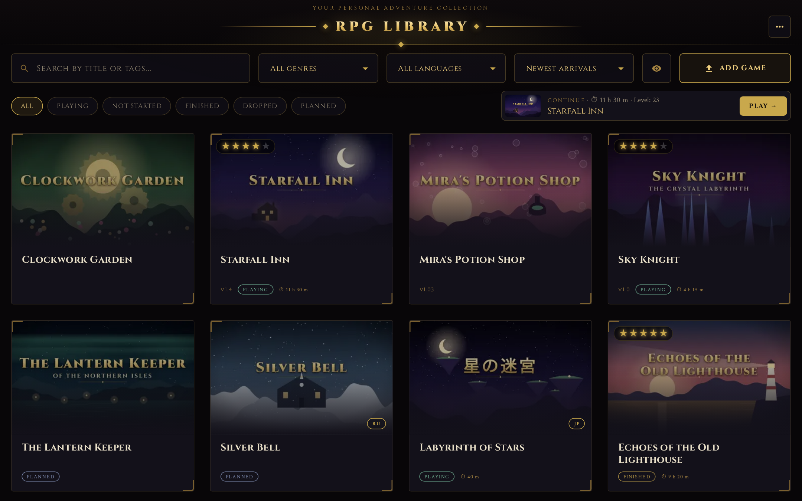
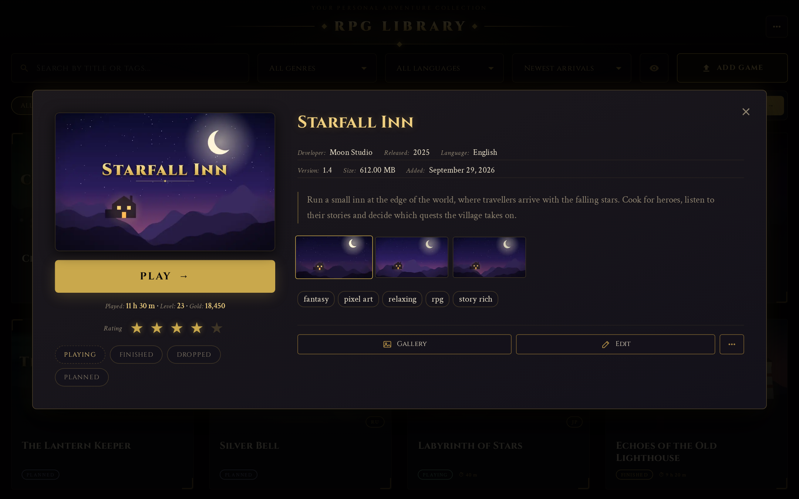
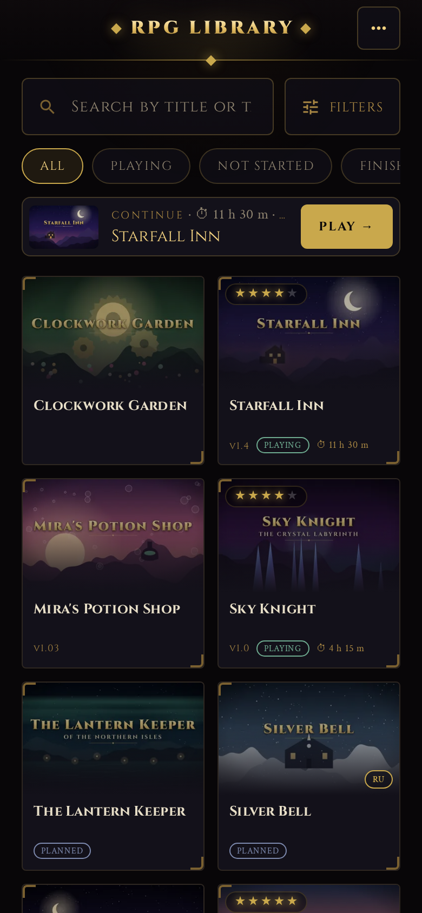

# 🎮 RPG Library v6.0

🇬🇧 [English](README.md) | 🇩🇪 [Deutsch](README.de.md)

[](https://github.com/Raven632/rpg-library/releases)
[](https://opensource.org/licenses/MIT)


Своя веб-библиотека RPG Maker игр (MV/MZ): игры лежат на домашнем сервере, играть — в браузере на
телефоне, планшете или ПК, а всё об играх сервер находит сам.



<p align="center">
  
  
</p>

## ✨ Возможности

### Играть

- **В любом браузере.** `rpg-fixes.js` подменяет NW.js, поэтому ПК-версии RPG Maker игр идут и на
  телефоне: звук на iPhone, ролики, шрифты, папки с любым регистром букв.
- **Облачные сейвы с историей.** Сейвы — на сервере: начали на ПК, продолжили на телефоне.
  Перезаписанный слот какое-то время хранится, и «История сейвов» вернёт любую версию; сейв, сделанный
  без сети, не затрёт более свежий с другого устройства.
- **Меню в игре:** турбо ×3, чит-меню, сохранение в любом месте карты, экранный геймпад и клавиатура,
  настоящий геймпад, растягивание и сглаживание, счётчик кадров.
- **Игры — на своём адресе**, отдельно от библиотеки: код игры не доберётся ни до данных библиотеки,
  ни до чужих сайтов.

### Библиотека

- **Данные находятся сами** — с itch.io, VNDB и Steam: обложка, скриншоты, описание, теги, автор, дата
  выхода. Каждое совпадение сверяется со всеми названиями игры.
- **Галерея из файлов самой игры** — CG, персонажи, фоны по альбомам, кадры проигрываются как
  анимация, и всё это без прохождения.
- **Статусы ставятся сами** («Играю», «Не начата»), а **«Во что поиграть?»** предложит игру из не
  начатых, с выбором жанра.
- **Новинки** из каталога itch.io — по тегам, периоду, цене и платформе — со списком «Хочу поиграть»
  и пометкой игр, которые уже есть в библиотеке.
- **Статистика и ревизия**: наигранное время, пробелы в данных, дубликаты, тяжёлые игры, ошибки,
  которые игры ловят на ваших устройствах.

### Загрузки

- **Любого размера, в том числе с телефона.** Оборванная загрузка продолжится с того же места — после
  перезагрузки страницы или с другого устройства. Архивы с паролем, игра в архиве внутри архива.
- **Обновить игру новой версией** — сейвы, время и данные остаются; **установить патч или мод**
  (английский патч, walkthrough-мод) поверх. Прежняя версия откладывается и возвращается одной
  кнопкой.

### Уведомления и безопасность

- **Telegram** (по желанию, свой бот): готовые загрузки, раз в день копия базы и сейвов, если что-то
  изменилось, проблемы. Всё, кроме проблем, — без звука, не больше десяти сообщений в час.
- **Резервная копия** базы и сейвов — из меню; ночная копия — на сервере.
- **Защита:** попытки входа ограничены, API отвечает только страницам самой библиотеки, в файле копии
  нет ключа входа, неудачная выкатка откатывается сама.
- **Интерфейс** на русском, английском и немецком; обложки скрываются одной кнопкой; изменения сразу
  видны на всех устройствах.

## 🧩 Как это устроено

- **Изоляция игр.** Игры отдаются с отдельного источника (`GAME_PORT`). Свои файлы и сейвы игра
  получает только по ключу в адресе — HMAC от секрета сессии, игры и её папки, — поэтому выход из
  библиотеки или замена игры его меняют. Content-Security-Policy не даёт коду игры обращаться к чужим
  сайтам, а API библиотеки проверяет Fetch Metadata (`Sec-Fetch-Site`), так что и к нему игра не
  достучится. Библиотека открывает игру на весь экран в рамке с `sandbox` и общается с ней через
  `postMessage`.
- **NW.js в браузере.** `api/public/rpg-fixes.js` даёт ПК-версиям то, чего они ждут от NW.js: замены
  `fs` и `path` из Node, своё пространство `localStorage` у каждой игры, облачные сейвы с очередью без
  сети и проверкой конфликтов, сенсорный геймпад, разблокировку звука на iOS и отчёты об ошибках на
  сервер.
- **Загрузки с продолжением.** Архив уходит кусками под скорость связи (16–256 МБ) и продолжается по
  отпечатку файла — имя, размер и хэш первого и последнего мегабайта — после перезагрузки или с другого
  устройства. Распаковка идёт фоном и доделывается после перезапуска сервера. На iOS ответ на большой
  запрос так и не приходит, поэтому страница подтверждает каждый кусок коротким запросом статуса.
- **Сейвы.** Атомарная запись (временный файл + rename), прореженная история каждого слота (пять
  последних, дальше по одной на 10 минут, не больше 30) и проверка конфликтов по времени сейва на
  устройстве.
- **Обновления и патчи без копий.** Патч ложится на копию игры из жёстких ссылок (`cp -al`); изменённый
  файл сначала отвязывается, потом заменяется, поэтому у прежней версии остаётся свой. Куда класть
  файлы патча, сервер узнаёт, сопоставляя их с файлами игры без учёта регистра.
- **Оглавление галереи.** Из каждой картинки читаются только первые 40 байт: размер дают PNG `IHDR`,
  WebP `VP8`/`VP8L`/`VP8X` и зашифрованные заголовки RPG Maker; по размеру и плотности байтов картинки
  делятся на CG, персонажей, фоны и слои, по именам кадры собираются в альбомы. Миниатюры — WebP,
  которые FFmpeg делает один раз.
- **Поиск данных.** Каждый поиск помнит, какие источники не ответили (`AsyncLocalStorage`), поэтому
  «не найдено» и «не смогли спросить» — разные итоги со своим расписанием повторов; названия
  очищаются и сравниваются коэффициентом Дайса; запросы к ScraperAPI ограничены дневным запасом
  кредитов.
- **Эксплуатация.** Docker Compose; выкатка забором с сервера с проверкой здоровья и откатом на
  прежний образ; ночные копии; оповещения в Telegram; CI гоняет тесты и сборку и двигает ветку
  `deploy`, за которой следит сервер.
- **Тесты.** Встроенный тест-раннер Node, без сети: источники подменены, загрузки и сервер игр
  поднимаются настоящими HTTP-серверами на свободных портах. Проверка на Playwright открывает каждую
  игру библиотеки в headless Chromium и сообщает, до какой сцены та дошла.

## 🛠 Технологии

- **Сервер:** Node.js 22, Express, Socket.io, Redis (кэш списка игр), SQLite.
- **Интерфейс:** React 19 + Vite.
- **Инструменты:** 7-Zip (`7zz`), FFmpeg, Docker Engine.
- **Тесты:** встроенный тест-раннер Node (модульные) и Playwright + headless Chromium (совместимость игр).

## 🚀 Установка

Для **Docker Engine** на Linux. Docker Desktop не советуем: через его виртуальную машину работа с
большими архивами медленная.

1. Склонируйте репозиторий:
   ```bash
   git clone https://github.com/Raven632/rpg-library.git
   cd rpg-library
   ```

2. (Необязательно) Создайте настройки — сервер запустится и без них:
   ```bash
   cp .env.example .env
   ```
   Все переменные описаны в файле. Стоит посмотреть:
   - `SESSION_SECRET` — свой ключ: `openssl rand -hex 64`. Без него ключ создастся при первом запуске.
   - `SCRAPER_API_KEY` — бесплатный ключ ScraperAPI (1000 кредитов в месяц): открывает страницы игр
     на itch.io; VNDB и Steam работают и без него.
   - `HTTP_PORT` (80) — библиотека, `GAME_PORT` (8081) — игры. **Оба должны быть доступны** с ваших
     устройств (домашняя сеть, Tailscale).
   - `TELEGRAM_BOT_TOKEN` — для уведомлений; дальше в библиотеке «⋯ → Telegram → Подключить».

3. Запустите:
   ```bash
   docker compose up -d --build
   ```

4. Откройте `http://<сервер>` (порт `HTTP_PORT`) и создайте учётную запись.

### Обновление с 5.x

Игры теперь открываются на своём порту — `GAME_PORT` (по умолчанию 8081): откройте его там же, где
открыт `HTTP_PORT`. Сейвы, лежавшие под «исправленным» именем папки, при первом запуске переедут под
настоящее имя игры. Если на каком-то устройстве игры в рамке не идут, `GAME_ISOLATION=off` в `.env`
вернёт прежний способ.

## 📂 Папки

Папка `./games` (`GAMES_HOST_DIR`) подключается в контейнер как `/games`:

- `/games/<игра>` — сами игры. В папку игры сервер никогда ничего не пишет.
- `/games/library.db` — база.
- `/games/_saves` — облачные сейвы; `_saves/.history` — прежние версии слотов.
- `/games/_media` — обложки, скриншоты, оглавление и миниатюры галереи.
- `/games/_old` — прежние версии обновлённых и пропатченных игр.
- `/games/_tmp_uploads` — идущие загрузки.

## 📜 История изменений

Что менялось от версии к версии — в [CHANGELOG.md](CHANGELOG.md).

## 📝 Если поиск промахнулся

Откройте игру, нажмите «Изменить» и вставьте ссылку — страницу на itch.io, в Steam или на VNDB.
Данные найдутся заново сразу.

## 📄 Лицензия

[MIT](LICENSE)
